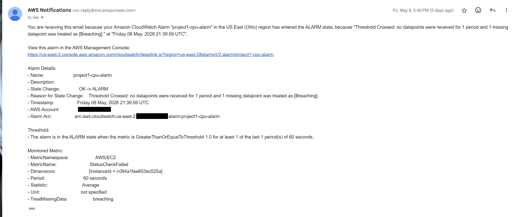
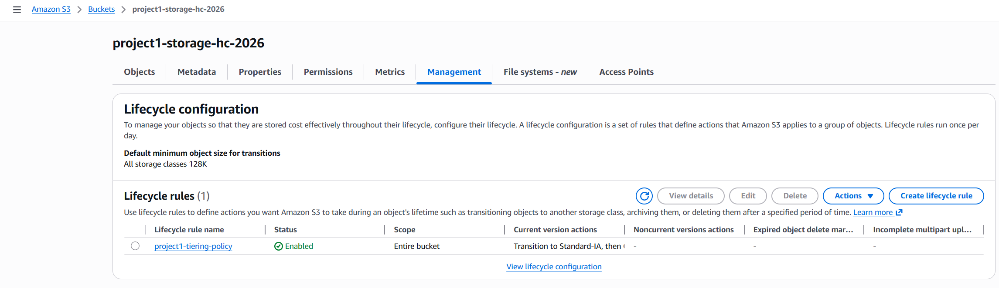
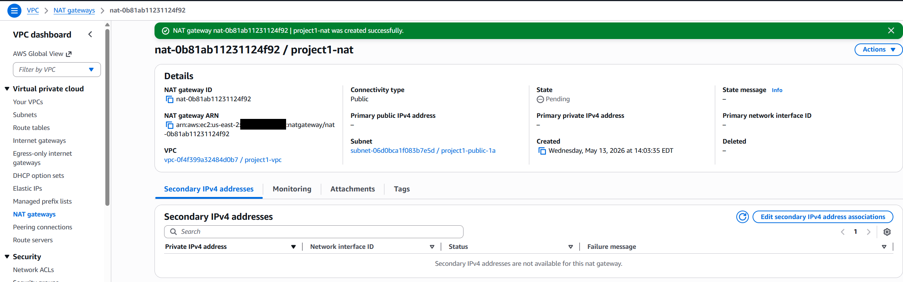
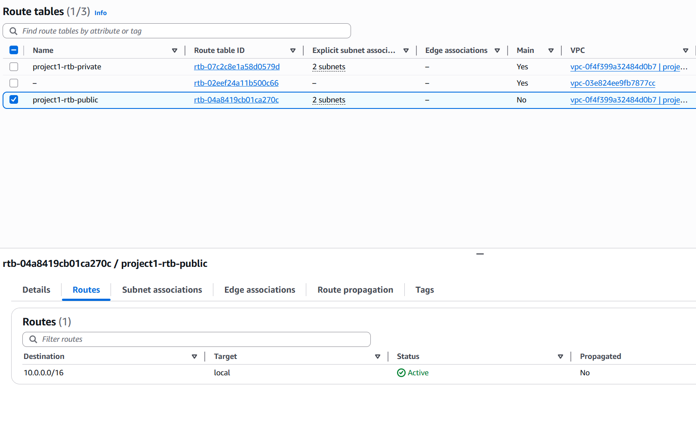
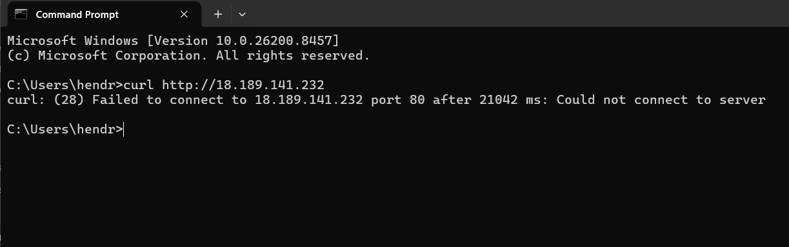

# AWS Cloud Architecture — Portfolio Project 1

A progressive, hands-on AWS architecture project built to demonstrate real cloud operations skills: provisioning, access control, storage management, cost optimization, monitoring, and fault diagnosis. Each phase intentionally introduces a misconfiguration that is traced and resolved using AWS-native logging tools.

**Status:** Phases 1–3 complete | Phases 4–7 in progress  
**Services used so far:** EC2, IAM, S3, VPC, CloudWatch, SNS, AWS Budgets, CloudTrail, VPC Flow Logs  
**Target roles:** Cloud Support Associate · Junior Systems Administrator · Cloud Operations Specialist

---

## Architecture Overview

> Current state: Phases 1–3 complete. Diagram regenerated at the end of each phase.

---

## Phase 1 — EC2 + CloudWatch + SNS + Billing Alarm

**Services:** EC2, IAM, CloudWatch, SNS, AWS Budgets

### What I built
- Configured a billing budget alarm before provisioning any resources — cost controls first, infrastructure second
- Created a scoped IAM admin user following least-privilege principles, avoiding root account usage for day-to-day work
- Deployed a live web application on an EC2 t3.micro instance, selected to minimize compute cost while meeting workload requirements
- Created an SNS topic with a confirmed email subscription to route alarm notifications
- Configured CloudWatch alarms tied to the SNS topic — when an alarm fires, an email is delivered automatically

### What I broke and how I found it
Stopped the application process on the EC2 instance to simulate a service outage. Watched the CloudWatch alarm transition from OK to ALARM state, received the SNS email notification, and confirmed the failure in CloudWatch Logs. This validated the full monitoring pipeline: failure → metric breach → alarm → notification.

### What I learned
- Stopped EC2 instances report missing data rather than a failed status check — CloudWatch alarms need to be configured to treat missing data as breaching, otherwise a powered-off instance shows as healthy
- SNS email subscriptions require confirmation before they deliver — an unconfirmed subscription silently drops notifications
- Billing alarms live in us-east-1 regardless of where your resources are deployed; CloudWatch must be set to that region to configure them

---

## Phase 2 — S3 + IAM + Lifecycle + Logging

**Services:** S3, IAM, CloudTrail, S3 Server Access Logs

### What I built
- Created a private S3 bucket with versioning enabled, SSE-S3 encryption, and all public access blocked from the start
- Demonstrated object recovery by simulating the most common Cloud Support ticket: a deleted file. Removed a delete marker to restore the previous version without any backup system
- Configured a lifecycle policy that automates storage cost optimization:
  - Days 0–30: S3 Standard (active access)
  - Days 30–90: S3 Standard-IA (infrequent access)
  - Days 90–365: S3 Glacier Flexible Retrieval (archival)
  - Day 365+: Automatic expiration
- Applied least-privilege access using two independent layers: an IAM policy scoped to the user identity, and a bucket policy scoped to the resource — both must allow the action for access to succeed
- Created a dedicated logging bucket and enabled S3 server access logging (object-level HTTP request activity) and a CloudTrail trail (control-plane API activity) for full audit coverage

### What I broke and how I found it
Applied a bucket policy with `"Effect": "Deny", "Principal": "*", "Action": "s3:*"` — a deny-all that locked out every principal in the account, including my own admin user. Confirmed the break by attempting to access the Objects tab and receiving an Access Denied error.

Traced the misconfiguration in CloudTrail Event History by filtering on the bucket name and locating the `PutBucketPolicy` event. The full JSON of the deny policy was visible in the event record, showing exactly when the change was made and under which identity.

Recovery required signing in as the root user — the only principal that retains bucket policy management access regardless of resource-based deny policies. Replaced the deny-all with the original scoped allow policy and confirmed access was restored.

### What I learned
- S3 versioning does not prevent deletion — it prevents permanent deletion. Delete markers make objects invisible without destroying the underlying versions
- S3 has two separate logging systems for two separate audiences: server access logs capture object-level request activity (ops visibility), CloudTrail captures API-level control plane activity (security auditing)
- `"Principal": "*"` with `"Effect": "Deny"` is an account-wide lockout. A safe deny policy always includes a condition that excludes the account root or a specific trusted principal
- IAM policies and bucket policies are evaluated independently — both must allow, and either can deny

---

## Phase 3 — VPC + Networking

**Services:** VPC, subnets, Internet Gateway, NAT Gateway, route tables, VPC Flow Logs

### What I built
- Created a custom VPC (`10.0.0.0/16`) to replace the default VPC — a flat network with no isolation is not appropriate for production workloads
- Provisioned four subnets across two Availability Zones: two public (`10.0.1.0/24`, `10.0.2.0/24`) and two private (`10.0.3.0/24`, `10.0.4.0/24`). Spreading across AZs means the architecture survives an AZ-level failure
- Created and attached an Internet Gateway, then configured the public route table with a `0.0.0.0/0 → IGW` rule — this route is what makes a subnet public, not its name
- Configured a private route table with no IGW route, ensuring private subnets are unreachable from the internet at the routing level
- Launched a NAT Gateway in the public subnet with an Elastic IP, then added a `0.0.0.0/0 → NAT` route to the private route table — private resources can initiate outbound connections but remain unreachable inbound
- Re-launched the EC2 web server into `project1-public-2a`, replacing the default VPC deployment with a properly isolated network
- Enabled VPC Flow Logs on the VPC, shipping to a CloudWatch Logs log group with 7-day retention

### What I broke and how I found it
Deleted the `0.0.0.0/0 → IGW` route from the public route table to simulate a misconfigured network. The EC2 instance stayed running and healthy at the status-check level, but the site was unreachable — browser requests timed out, and `curl` confirmed a connection timeout with no response.

Opened VPC Flow Logs expecting to see REJECT entries for the dropped traffic. Instead, Flow Logs showed ACCEPT entries for inbound packets from my IP on port 80 — indistinguishable from a healthy site. The inbound packets were passing the security group check on arrival, so Flow Logs recorded them as ACCEPT. The actual failure was on the return path: the EC2 instance had no `0.0.0.0/0 → IGW` route to send the HTTP response back out to the internet, so the response packets never left the subnet. Flow Logs does not surface that kind of routing failure as a REJECT — it simply never records the response side of the conversation.

This is the lesson the exercise actually teaches: ACCEPT in Flow Logs means a packet was not blocked. It does not mean the connection succeeded. When a site is down but Flow Logs shows ACCEPT, the failure is downstream of the security group — most often a routing or NAT problem on the return path. The diagnostic signal here was the contrast between `curl` (timeout) and Flow Logs (ACCEPT), not the presence of a REJECT entry.

Restored the IGW route and confirmed the site loaded again.

### What I learned
- A subnet is public or private based on its route table, not its name — the `0.0.0.0/0 → IGW` entry is the definition of a public subnet
- Route tables use longest prefix match, not top-to-bottom priority. `10.0.0.0/16 → local` always wins over `0.0.0.0/0 → IGW` for internal traffic because it is more specific
- The Internet Gateway does not filter traffic — it is a dumb pipe. ACCEPT and REJECT decisions happen at the security group, not the IGW
- Flow Logs records security group decisions on each ENI — not connection success. When the IGW route was deleted, Flow Logs kept showing ACCEPT for inbound packets on port 80 because the SG check passed; the failure was on the return path, which never surfaces as a REJECT. ACCEPT means "not blocked," not "delivered." Diagnosing routing failures requires correlating Flow Logs with external evidence (curl, browser timeouts), not Flow Logs alone
- REJECT in Flow Logs means a packet was blocked by a security group or NACL — typically internet scanners hitting closed ports. A REJECT is a useful security signal, but its absence does not mean the network is healthy
- A VPC Flow Log line decoded: `version account-id interface-id srcaddr dstaddr srcport dstport protocol packets bytes start end action log-status` — the `action` field is ACCEPT or REJECT, `log-status` OK means the log was captured successfully
- NAT Gateways are zonal resources. One NAT per AZ is the production pattern — a single NAT is a single point of failure. This project uses one NAT as a cost tradeoff; production would use two
- Elastic IPs are static public IP addresses owned until explicitly released. AWS charges for allocated but unattached Elastic IPs — always release them when deleting the attached resource
- The private subnets and NAT Gateway are built and wired correctly but not yet exercised — they will be validated when RDS is added in Phase 4

---

## Phases 4–7 — In Progress

| Phase | Focus | Status |
|-------|-------|--------|
| 4 | ALB + RDS Multi-AZ | Upcoming |
| 5 | Auto Scaling Group | Upcoming |
| 6 | Lambda + SQS (serverless + decoupling) | Upcoming |
| 7 | CloudFront + Route 53 + ACM (optional polish) | Upcoming |

---

## Cost Controls

A billing budget alarm was configured in Phase 1 before any resources were provisioned. All compute uses t3.micro (Free Tier eligible). Resources not in active use are stopped to avoid unnecessary charges. The NAT Gateway (~$1/day) is deleted between sessions and recreated at the start of each working session to avoid idle charges.
